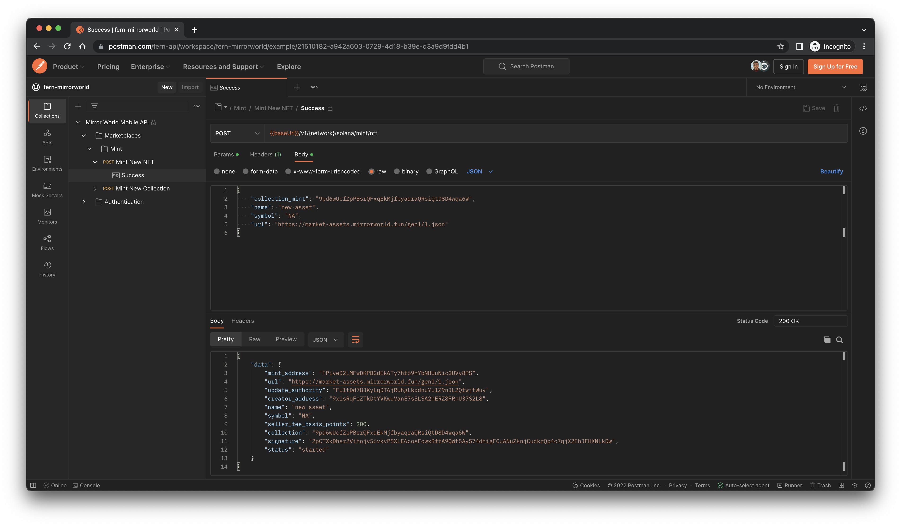

## Mirror World Postman Collection

This repository contains the unified Postman Collection for all the Mirror World APIs.

## Contributing

While we value open-source contributions to this Postman Collection, this
library is generated programmatically. Additions made directly to this library
would have to be moved over to our generation code, otherwise they would be
overwritten upon the next generated release. Feel free to open a PR as a proof
of concept, but know that we will not be able to merge it as-is. We suggest
opening an issue first to discuss with us!

On the other hand, contributions to the README are always very welcome!